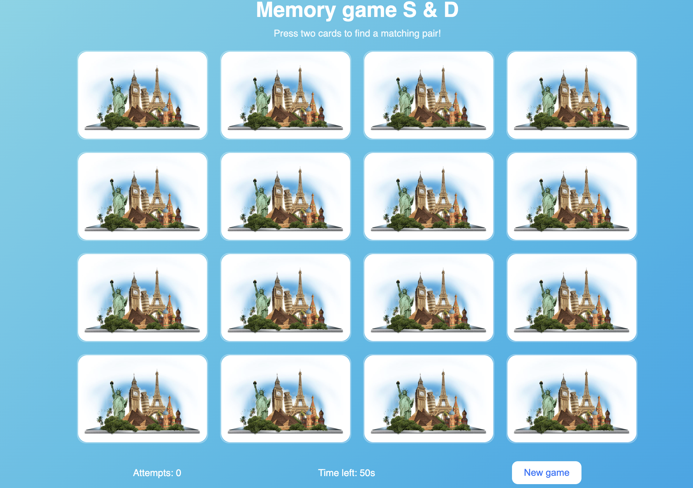
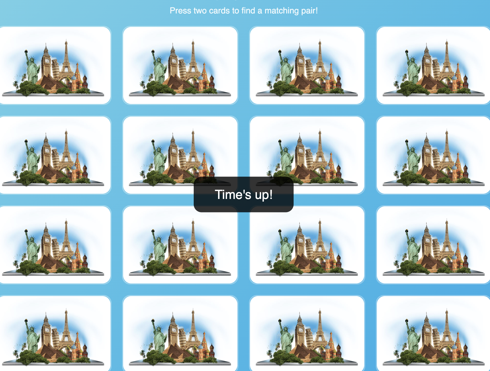

# Memory Game  S&D

A simple and fun **memory card game** built using **HTML, CSS, and JavaScript**.  
The goal is to find all matching pairs before the timer runs out of the time.


## Game Preview



*Memory Game S&D showing picture before game starts*


##  How to Play

1. Click on two cards to find a matching pair.  
2. If the images match cards stay flipped.  
3. If they don’t match the cards automatically flip back after a short delay.  
4. The goal is to find all pairs before time runs out (50 seconds).  

5. When the time runs out, a “Time’s up!” message appears in the center and the game automatically resets.


  


*Memory game S&D showing how screen looks when time's up* 


## Features

 * Random card shuffling
 * Reset button

* Countdown timer

* Move blocking during pair checking

* Auto-flip back if the second card isn’t clicked

* “Time’s up!” popup centered on screen + automatic game restart

 

 *Picture showing all pictures faced Up*


##  How to Run the Memory Game S&D

1. Download or clone this repository:
   ```bash
   git clone https://github.com/RajnaSjajna/Project-memory-game/
